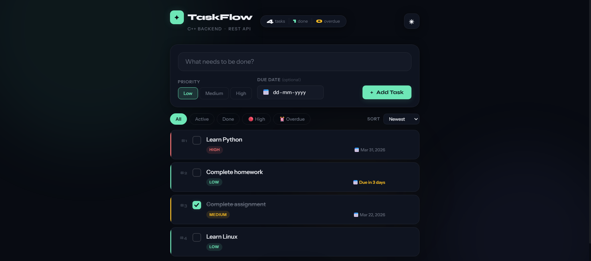
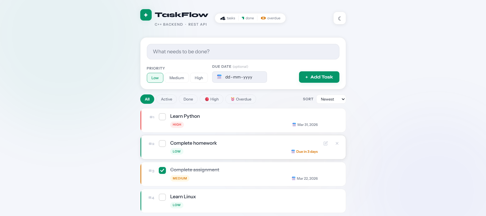

# ✦ TaskFlow — C++ Task Manager Web App

A full-stack task manager built with a **C++ HTTP backend** and a **vanilla HTML/CSS/JS frontend**. The browser communicates with the C++ server through a REST API, while tasks are persisted to a local file.

---

## Preview






---

## Features

- ✅ Add, complete, and delete tasks
- 🎨 Priority levels — Low, Medium, High (colour-coded)
- 📅 Due dates with smart labels (Due today, Due tomorrow, Overdue)
- ✏️ Edit priority and due date after a task is created
- 🌙 Dark / Light mode toggle (saved to localStorage)
- 🔢 Auto-updating serial numbers (#1, #2, #3…)
- 🔍 Filter by All / Active / Done / High Priority / Overdue
- 🔽 Sort by Newest / Priority / Due Date
- 📊 Live task counter (total, done, overdue)
- 💾 File-based persistence — tasks survive server restarts

---

## Tech Stack

| Layer    | Technology |
|----------|------------|
| Backend  | C++17, [cpp-httplib](https://github.com/yhirose/cpp-httplib) |
| Frontend | HTML5, CSS3, Vanilla JavaScript |
| Storage  | Flat file (`tasks.txt`) |
| Compiler | GCC (MSYS2 MinGW-w64 on Windows) |

---

## Project Structure

```
TaskFlow/
│
├── backend/
│   ├── server.cpp          ← HTTP server & API routes
│   ├── taskmanager.cpp     ← Task logic & file storage
│   ├── taskmanager.h       ← Task class definitions
│   └── httplib.h           ← cpp-httplib (download separately)
│
├── frontend/
│   ├── index.html          ← App UI
│   ├── style.css           ← Styles & dark/light theme
│   └── script.js           ← API calls & rendering
│
├── start.bat               ← One-click launch (Windows)
└── README.md
```

---

## Getting Started

### Prerequisites

- **Windows:** [MSYS2](https://www.msys2.org) with MinGW-w64
  ```bash
  pacman -S mingw-w64-ucrt-x86_64-gcc
  ```
- **Linux/Mac:** GCC 9+ (usually pre-installed)
  ```bash
  sudo apt install g++   # Ubuntu/Debian
  brew install gcc       # macOS
  ```

---

### Step 1 — Get cpp-httplib

`httplib.h` is already included in this repository — no download needed.

Simply make sure it is inside the `backend/` folder alongside `server.cpp` before compiling.

> **Optional:** To update to the latest version, download `httplib.h` manually from
> https://github.com/yhirose/cpp-httplib and replace the existing file.

---

### Step 2 — Compile the Backend

**Windows (MSYS2 / MinGW-w64):**
```bash
cd backend
g++ -std=c++17 -o server.exe server.cpp taskmanager.cpp -lws2_32 -static
```

**Linux / Mac:**
```bash
cd backend
g++ -std=c++17 -o server server.cpp taskmanager.cpp -lpthread
```

---

### Step 3 — Run the Server

**Option A — One click (recommended):**
Double-click `start.bat` in the project root. Done.

**Option B — Manual (Windows):**
```bash
cd backend
./server.exe
```

**Option B — Manual (Linux / Mac):**
```bash
cd backend
./server
```

You should see:
```
TaskFlow server running at http://localhost:8080
```

---

### Step 4 — Open the Frontend

**If you used `start.bat`:** The browser opens automatically — nothing to do.

**If you ran the server manually:** Double-click `frontend/index.html` in File Explorer.

> Do **not** use VS Code Live Server — open the file directly so it
> can reach `localhost:8080`.

---

### One-Click Launch (Windows)

`start.bat` is already included in the repository root.

Just double-click it — it automatically starts the server and opens the frontend in your browser.

**What it does:**
1. Opens a terminal window running `server.exe`
2. Waits 2 seconds for the server to start
3. Opens `frontend/index.html` in your default browser

> To stop the app, just close the black server terminal window.
---

## REST API Reference

The frontend communicates with the C++ backend through these endpoints:

| Method | Route        | Body                          | Description                  |
|--------|--------------|-------------------------------|------------------------------|
| GET    | `/tasks`     | —                             | Returns all tasks as JSON    |
| POST   | `/add`       | `description\|\|priority\|\|dueDate` | Adds a new task       |
| POST   | `/complete`  | `id`                          | Toggles task completion      |
| POST   | `/update`    | `id\|\|priority\|\|dueDate`   | Updates priority and/or date |
| POST   | `/delete`    | `id`                          | Deletes a task               |

### Example JSON response from `GET /tasks`

```json
[
  {
    "id": 1,
    "description": "Learn C++",
    "completed": false,
    "priority": "high",
    "dueDate": "2026-03-20"
  },
  {
    "id": 2,
    "description": "Build the frontend",
    "completed": true,
    "priority": "medium",
    "dueDate": ""
  }
]
```

---

## Storage Format

Tasks are saved to `backend/tasks.txt` in a pipe-delimited format:

```
1|0|high|2026-03-20|Learn C++
2|1|medium||Build the frontend
3|0|low|2026-04-01|Write documentation
```

**Format per line:** `id | completed (0/1) | priority | dueDate | description`

> If you change the storage format after running an older version, delete `tasks.txt` before starting the server.

---

## C++ Architecture

```
main() in server.cpp
    │
    ├── httplib::Server         ← handles HTTP requests
    │       ├── GET  /tasks     ← returns manager.toJSON()
    │       ├── POST /add       ← manager.addTask()
    │       ├── POST /complete  ← manager.completeTask()
    │       ├── POST /update    ← manager.updateTask()
    │       └── POST /delete    ← manager.deleteTask()
    │
    └── TaskManager             ← business logic
            ├── vector<Task>    ← in-memory task list
            └── tasks.txt       ← file persistence
```

---

## Possible Extensions

- [ ] Search / filter by keyword
- [ ] Drag to reorder tasks
- [ ] Recurring tasks
- [ ] Tags / categories
- [ ] Export to CSV
- [ ] Node.js backend version for cloud deployment (Vercel / Render)
- [ ] SQLite database instead of flat file

---

## What This Project Demonstrates

| Concept | Where |
|---|---|
| C++ OOP (classes, vectors, file I/O) | `taskmanager.cpp` |
| C++ HTTP server | `server.cpp` + `httplib.h` |
| REST API design | All `/routes` in `server.cpp` |
| Vanilla JS fetch API | `script.js` |
| CSS custom properties & theming | `style.css` |
| Dark/Light mode | CSS variables + `data-theme` |
| Full-stack thinking | All of the above |

---

## License

MIT — free to use, modify, and distribute.

---

## Author

**Junaid** — Built from scratch using C++17 and vanilla web technologies.

- GitHub: [@junaidE0x](https://github.com/junaidE0x)
- LinkedIn: [Junaid E. Ahmed](https://linkedin.com/in/junaid-ea-130205s)

---

*Built with C++17 and zero frameworks.*
